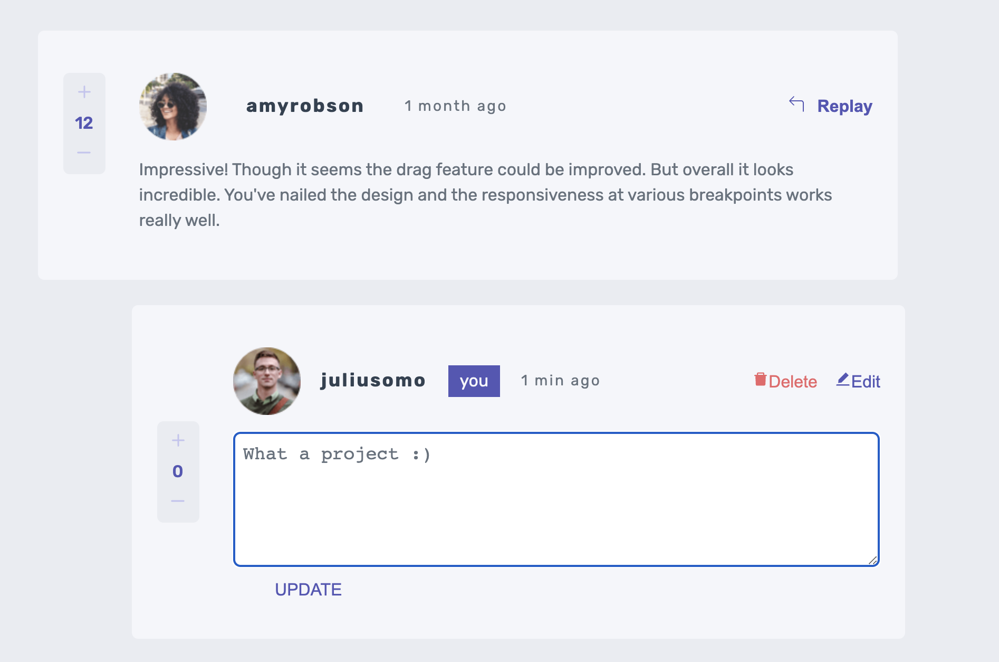
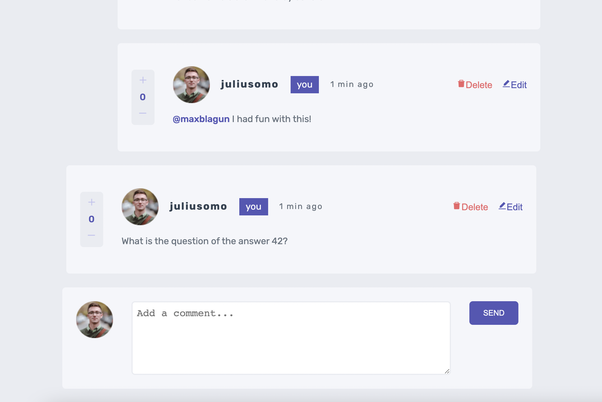

## Interactive Comments Section // Frontend Mentor // React JS

- [see project](https://sweta-interactive-comments-section-fm.netlify.app)
- The data is stored in a local data.json file.
- The users should be able to:
  - Create, Read, Update, and Delete comments and replies
  - Upvote and downvote comment. Only comments that are from other users.
  - localStorage is used to save the current state in the browser that persists when the browser is refreshed.

    

 

    

 

#### Comments about the code

- The data from data.js is imported in context.js. It is set to LocalStorage. Every time we update it, it gets updated in LocalStorage.
- Initial data is displayed in App.js. If we have author comment or replay, I use a separate component AuthorComment because the author comments have different css.
- There are two forms, ReplayForm and NewCommentForm with delete and edit buttons. On Submit, I take the text and parent comment and update the data in context.js. If the text is '', nothing gets displayed.
